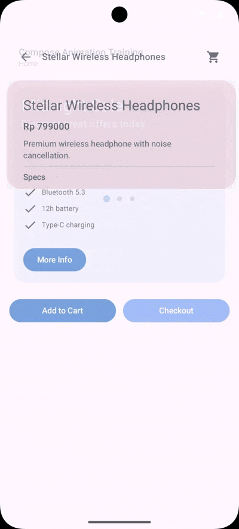
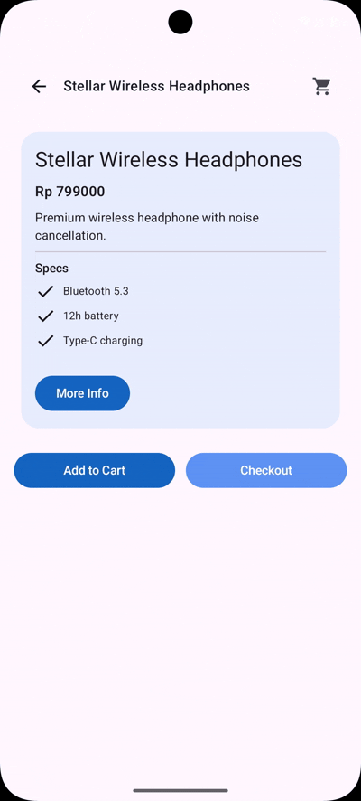
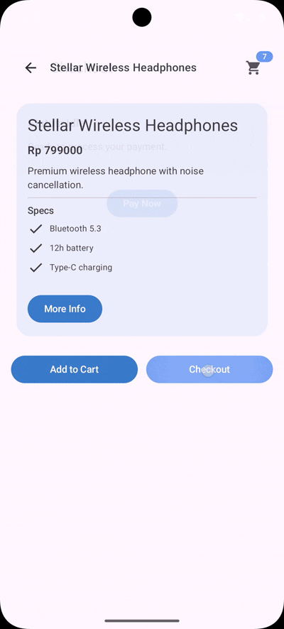
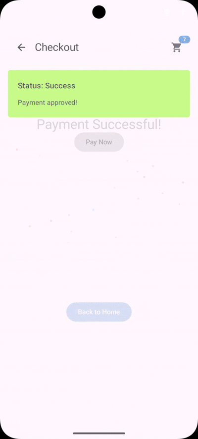

# ComposeAnimation

An Android training project that walks through Jetpack Compose animation techniques across a simple shopping journey. Use it to explore how different animation primitives fit into real UI flows.

## Purpose
- Practice building a multi-screen Compose app end-to-end.
- Compare implementations with and without animations via the exercise and final branches.
- Learn how simple, visibility, content, transition, and canvas animations feel in a real product scenario.

## Running the Project
1. Open the repository in Android Studio Meerkat or newer.
2. Sync Gradle (Kotlin 1.9.x with the Compose BOM is already configured).
3. Run the `app` configuration on an emulator or device running Android 7.0 (API 24) or above.

## Animation Types Covered
- **HomeScreen** — Simple animation for sliding and breathing banner effects plus animated page indicators.
<br><br>

- **ProductDetailScreen** — Visibility animation with `fadeIn`/`fadeOut` and `expandVertically`/`shrinkVertically`, wrapped in `animateContentSize`.
<br><br>

- **Cart Badge** — Content animation for number transitions with slide, fade, and scale.
<br><br>

- **CheckoutScreen** — Advance animation animating color, radius, scale, and rotation, plus a keyframe-based shake on failure.
<br><br>
<br><br>

- **CheckoutSuccessScreen** — Canvas-drawn confetti driven by `rememberInfiniteTransition`.
<br><br> 

## Flow Overview
```
HomeScreen → ProductDetailScreen → CheckoutScreen → CheckoutSuccessScreen
```

- Tap a banner on Home to view the product details.
- Add to cart or jump directly to checkout.
- Run the checkout state machine; success navigates to the confetti screen, failure stays put.

Happy animating!
